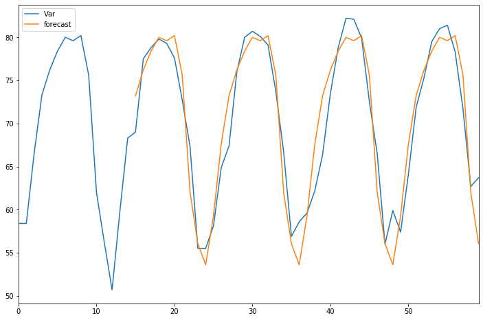
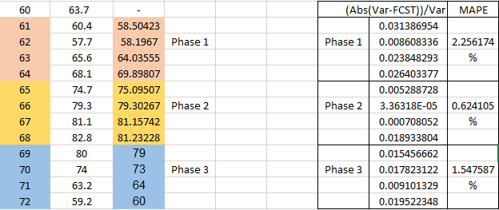

# Univariate-Forecasting-Using-Seasonal-Auto-Regressive-Integrated-Moving-Average-SARIMA
Univariate data having seasonal nature is used and forecasting is done using Seasonal ARIMA Technique. The full code and detailed report is uploaded.

• Successfully forecasted a univariate model using SARIMA.

• The forecasting algorithm built performs effectively and can be used for forecasting values if the dataset follows a seasonal pattern.

• One of the unique method used in this project is the way the forecasting is done. The forecasting is carried out in 3 stages and the output of one stage is added to the dataset to be used as the input for next stage.

• The performance criteria used to test the forecasting model is 'Mean Average Percentage Error' which comes out to be 1.475% for the combined 3 stages.

# Applications: 
• Seasonal or Quarterly-Order Quantity/Demand/Supply/Sales Forecasting.

# Model Performance: Historical Data vs Forecast

# Final Unknown Predictions using SARIMA Model & Results 

